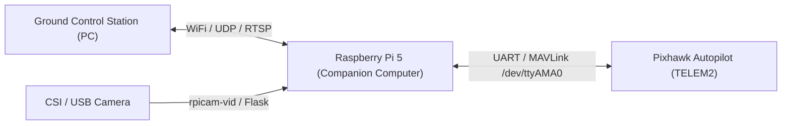

# Raspberry Pi and Pixhawk Integration Guide
## Companion Computer Setup for Autonomous Drone Control

[](https://www.raspberrypi.com)
[](https://www.raspberrypi.com)
[](https://ardupilot.org)
[](https://mavlink.io)
[](https://python.org)
[](https://www.raspberrypi.com/documentation/computers/camera_software.html)

---

## Table of Contents
- [1. System Overview](#1-system-overview)
- [2. Hardware Specifications and Wiring Matrix](#2-hardware-specifications-and-wiring-matrix)
- [3. Raspberry Pi 5 Setup Guide](#3-raspberry-pi-5-setup-guide)
  - [3.1 Headless OS Flashing and Network Preparation](#31-headless-os-flashing-and-network-preparation)
  - [3.2 SSH and Remote Desktop Access (Wayland / WayVNC)](#32-ssh-and-remote-desktop-access-wayland--wayvnc)
  - [3.3 Hardware UART Configuration on Pi 5 (RP1 Architecture)](#33-hardware-uart-configuration-on-pi-5-rp1-architecture)
  - [3.4 Python Environment and MAVLink Software Installation](#34-python-environment-and-mavlink-software-installation)
  - [3.5 Autopilot (Pixhawk) Parameter Configuration](#35-autopilot-pixhawk-parameter-configuration)
  - [3.6 MAVLink Communication and Heartbeat Verification](#36-mavlink-communication-and-heartbeat-verification)
  - [3.7 Low-Latency Video Streaming (rpicam-vid)](#37-low-latency-video-streaming-rpicam-vid)
- [4. Raspberry Pi 4 Setup Guide](#4-raspberry-pi-4-setup-guide)
- [5. Troubleshooting Reference](#5-troubleshooting-reference)
- [6. Additional Resources](#6-additional-resources)

---

## 1. System Overview

This repository provides a step-by-step technical guide for interfacing a Raspberry Pi (Raspberry Pi 4 and Raspberry Pi 5) with a Pixhawk flight controller running ArduPilot or PX4 firmware. The Raspberry Pi functions as an onboard companion computer for offboard autonomous control, telemetry routing, computer vision, and video streaming to Ground Control Stations (Mission Planner or QGroundControl).



---

## 2. Hardware Specifications and Wiring Matrix

### Physical Connection (GPIO to Pixhawk TELEM2)

| Raspberry Pi Pin | Pin Function | Pixhawk TELEM2 Pin | Pin Description |
| :--- | :--- | :--- | :--- |
| **Pin 6** | Ground (GND) | **Pin 6** | Ground (GND) |
| **Pin 8** | GPIO 14 (TXD0) | **Pin 3** | RX (Telemetry Receive) |
| **Pin 10** | GPIO 15 (RXD0) | **Pin 2** | TX (Telemetry Transmit) |

> **Power Notice**: Do not power the Raspberry Pi 5 from the 5V pin of the Pixhawk TELEM port. The Raspberry Pi 5 requires a dedicated 5V / 5A power source connected through USB-C or a regulated step-down BEC module.

---

## 3. Raspberry Pi 5 Setup Guide

### 3.1 Headless OS Flashing and Network Preparation
1. Insert your microSD card into your computer.
2. Open **Raspberry Pi Imager**:
   - **Device**: Select `Raspberry Pi 5`.
   - **Operating System**: Select `Raspberry Pi OS (64-bit)` (Debian 12 Bookworm).
   - **Storage**: Select your microSD card.
3. Click **Next** and select **Edit Settings**:
   - **General**: Set Hostname (`raspberrypi-drone`), Username, and Password.
   - **Wireless LAN**: Enter your WiFi network SSID and Password.
   - **Services**: Check **Enable SSH** and choose *Use password authentication*.
4. Click **Save** and write the operating system.

---

### 3.2 SSH and Remote Desktop Access (Wayland / WayVNC)

#### Connect via SSH
Insert the microSD card into the Raspberry Pi 5, power it on, and connect from your PC terminal or PuTTY:

```bash
ssh <username>@<RASPBERRY_PI_IP>
```

#### Remote Desktop Access (WayVNC)
Raspberry Pi OS Bookworm on Pi 5 uses the **Wayland** display server by default.

* **Method 1: Native WayVNC (Default)**:
  1. Enable VNC:
     ```bash
     sudo raspi-config
     ```
     Navigate to: `Interface Options` → `VNC` → Select `Yes`.
  2. Connect using **TigerVNC Viewer** or **RealVNC Viewer** (v7.x or higher) to `<RASPBERRY_PI_IP>:5900`.

* **Method 2: Switch to X11 (For Legacy VNC Clients)**:
  1. Open configuration:
     ```bash
     sudo raspi-config
     ```
  2. Navigate to: `Advanced Options` → `Wayland` → Select `X11 (Openbox)`.
  3. Reboot:
     ```bash
     sudo reboot
     ```

---

### 3.3 Hardware UART Configuration on Pi 5 (RP1 Architecture)

On Raspberry Pi 5, peripheral I/O is managed by the RP1 chip. Firmware boot parameters are stored in `/boot/firmware/config.txt`.

#### Step 1: Enable Hardware Serial Port
1. Open the configuration tool:
   ```bash
   sudo raspi-config
   ```
2. Navigate to: `Interface Options` → `Serial Port`.
3. Set **Login Shell over Serial**: `No`.
4. Set **Serial Port Hardware**: `Yes`.

#### Step 2: Configure `/boot/firmware/config.txt`
```bash
sudo nano /boot/firmware/config.txt
```

Add the following lines at the end of the file:

```ini
# Enable primary UART on GPIO 14/15 for Pixhawk Telemetry
enable_uart=1
dtoverlay=uart0
```

Save and exit (`Ctrl + O`, `Enter`, `Ctrl + X`).

#### Step 3: Disable Serial Console Service
```bash
sudo systemctl stop serial-getty@ttyAMA0.service
sudo systemctl disable serial-getty@ttyAMA0.service
sudo reboot
```

> The primary GPIO UART on Raspberry Pi 5 corresponds to `/dev/ttyAMA0` (aliased as `/dev/serial0`).

---

### 3.4 Python Environment and MAVLink Software Installation

Debian 12 Bookworm enforces PEP 668 to prevent system Python package conflicts. Use a dedicated Python virtual environment:

#### Step 1: Install System Dependencies
```bash
sudo apt update
sudo apt install -y python3-pip python3-venv python3-dev build-essential libxml2-dev libxslt-dev
```

#### Step 2: Create and Activate Virtual Environment
```bash
mkdir -p ~/drone_ws && cd ~/drone_ws
python3 -m venv venv --system-site-packages
source ~/drone_ws/venv/bin/activate
```

#### Step 3: Install MAVLink Packages
```bash
pip install --upgrade pip
pip install pymavlink mavproxy dronekit
```

> To automatically load the virtual environment on every terminal session:
> ```bash
> echo "source ~/drone_ws/venv/bin/activate" >> ~/.bashrc
> ```

---

### 3.5 Autopilot (Pixhawk) Parameter Configuration

Connect the Pixhawk to **Mission Planner** or **QGroundControl** via USB, open the Full Parameter List, and set the following for the TELEM2 port:

| Parameter | Recommended Value | Purpose |
| :--- | :--- | :--- |
| `SERIAL2_PROTOCOL` | `2` | MAVLink 2 protocol |
| `SERIAL2_BAUD` | `57` (57600 baud) or `921` (921600 baud) | UART transmission speed |
| `BRD_SER2_RTSCTS` | `0` | Disable hardware flow control for 3-wire wiring |

*Write parameters to the board and power cycle the Pixhawk.*

---

### 3.6 MAVLink Communication and Heartbeat Verification

#### Step 1: Launch MAVProxy Bridge
Forward MAVLink telemetry from the serial port to local scripts and your Ground Control Station:

```bash
mavproxy.py --master=/dev/ttyAMA0 --baudrate 57600 --out=127.0.0.1:14550 --out=<GCS_IP_ADDRESS>:14550
```

#### Step 2: Python Script to Verify Heartbeat
Create a script named `check_heartbeat.py`:

```python
from pymavlink import mavutil
import time

# Connect to Pixhawk on primary UART
print("Connecting to Pixhawk on /dev/ttyAMA0...")
connection = mavutil.mavlink_connection('/dev/ttyAMA0', baud=57600)

# Wait for the first heartbeat packet
print("Waiting for heartbeat...")
connection.wait_heartbeat()
print(f"Heartbeat received from System ID: {connection.target_system}, Component ID: {connection.target_component}")

# Read vehicle status
while True:
    msg = connection.recv_match(type='HEARTBEAT', blocking=True)
    if msg:
        mode = mavutil.mode_string_v10(msg)
        is_armed = msg.base_mode & mavutil.mavlink.MAV_MODE_FLAG_SAFETY_ARMED
        print(f"Mode: {mode} | Armed: {'YES' if is_armed else 'NO'}")
    time.sleep(1)
```

Run the script:
```bash
python check_heartbeat.py
```

---

### 3.7 Low-Latency Video Streaming (rpicam-vid)

On Raspberry Pi 5, use `rpicam-apps` for camera operations:

#### Step 1: Install Camera Dependencies
```bash
sudo apt install -y rpicam-apps gstreamer1.0-tools gstreamer1.0-plugins-good gstreamer1.0-plugins-bad
```

#### Step 2: Test Camera Interface
```bash
rpicam-hello -t 5000
```

#### Step 3: Stream Video over UDP to Ground Control Station
```bash
rpicam-vid -t 0 --inline --width 1280 --height 720 --framerate 30 --codec h264 -o udp://<GCS_IP_ADDRESS>:5600
```

*In QGroundControl: Settings → Video → Source = `UDP h.264 Video Stream`, Port = `5600`.*

---

## 4. Raspberry Pi 4 Setup Guide

<details>
<summary><strong>Click to expand Raspberry Pi 4 instructions</strong></summary>

### Key Pi 4 Differences:
1. **Config File**: Located at `/boot/config.txt`.
2. **Serial Port**: Uses `/dev/serial0` (or `/dev/ttyS0` / `/dev/ttyAMA0`).
3. **Display Server**: Uses standard X11 with native RealVNC support.

### UART Configuration for Pi 4:
```bash
sudo nano /boot/config.txt
```
Append:
```ini
enable_uart=1
dtoverlay=disable-bt
```
Disable Bluetooth modem service:
```bash
sudo systemctl disable hciuart
```
Launch MAVProxy:
```bash
mavproxy.py --master=/dev/serial0 --baudrate 57600 --out=127.0.0.1:14550 --out=<GCS_IP_ADDRESS>:14550
```

</details>

---

## 5. Troubleshooting Reference

| Issue / Symptom | Root Cause | Resolution |
| :--- | :--- | :--- |
| `Permission denied: '/dev/ttyAMA0'` | User account lacks serial permissions | Run `sudo usermod -a -G dialout $USER` and log in again |
| `error: externally-managed-environment` | Debian 12 PEP 668 restriction | Use Python virtual environment (`python3 -m venv ~/drone_ws/venv`) |
| No heartbeat received in MAVProxy | RX/TX wires swapped or mismatched baud rate | Verify Pin 8 (TX) to Pixhawk RX, Pin 10 (RX) to Pixhawk TX, and match `SERIAL2_BAUD` |
| VNC shows black screen on Pi 5 | Wayland authentication incompatibility | Connect with TigerVNC or switch display backend to X11 in `raspi-config` |

---

## 6. Additional Resources
* [Camera Streaming Setup Guide](Camera_stream.md)
* [ArduPilot Companion Computer Documentation](https://ardupilot.org/dev/docs/companion-computers.html)
* [Raspberry Pi Documentation](https://www.raspberrypi.com/documentation/)
